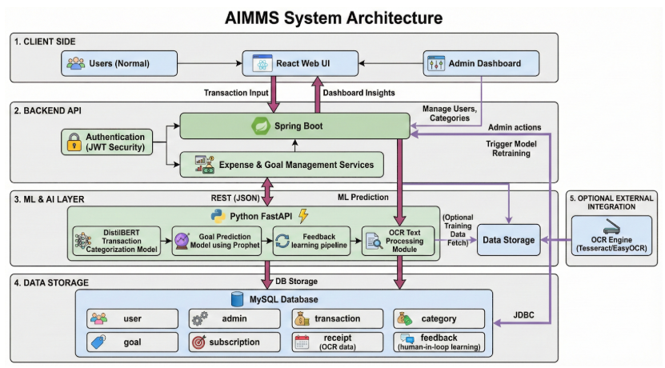

# AIMMS - AI Integrated Money Management System

The integration of advanced AI models within a financial management system, aimed at automating expense tracking, categorizing transactions, and predicting financial goals to improve user financial health.

## About
AIMMS (AI Integrated Money Management System) is a project designed to integrate machine learning and OCR technologies to streamline personal finance management. Traditional methods involve manual data entry and lack predictive insights. This project seeks to overcome these challenges by creating an automated interface that scans receipts, categorizes spending, and predicts future financial milestones.

## Features
- **Advanced OCR Integration**: Utilizes specialized deep learning models (Donut) for accurate receipt text extraction.
- **Automated Categorization**: Implements DistilBERT infrastructure for higher accuracy in transaction classification.
- **Predictive Analytics**: Forecasting financial goals and spending trends using XGBoost and Logistic Regression.
- **High Scalability**: Built on a robust Microservices architecture.
- **Secure & Efficient**: Optimized for low latency and high data security.
- **API Response Model**: Standardized JSON data formats for seamless communication between services.

## Requirements
- **Operating System**: Requires a 64-bit OS (Windows 10/11 or Ubuntu) for compatibility with deep learning frameworks.
- **Backend**: Java 17+ and Spring Boot for the core application logic.
- **Frontend**: Node.js and React/Vite for a responsive user interface.
- **Deep Learning Env**: Python 3.8+ is necessary for the AI microservices.
- **DL Frameworks**: PyTorch and Transformers for model inference; Scikit-learn for regression models.
- **Database**: MySQL for structured data storage.
- **Version Control**: Implementation of Git for collaborative development.
- **IDE**: Use of VSCode or IntelliJ IDEA.

## System Architecture

## Output
### Output 1 - Dashboard View

### Detection Accuracy
- **OCR Accuracy**:  ~95%
- **Categorization Accuracy**:  ~92%
*Note: These metrics are based on initial validation datasets.*

## Results and Impact
The AIMMS platform significantly enhances the user's ability to track and manage finances by automating tedious tasks. The integration of computer vision and NLP showcases the potential of AI in personal finance, providing a foundation for smarter, data-driven financial decisions.

## Articles published / References
1. D. S, S. R. S. Suvarna Smita, R. Sheethal, T. V. Dixit, S. Sri Balaji, and T. D. Sivadharishana, "FINANCEGPT: PRECISION FINANCIAL FORECASTING AND BUDGETING FOR SMARTER INVESTMENT STRATEGIES," in 2025 6th International Conference on Control, Communication and Computing (ICCC), 2025. 
2. S. Shelke, S. Shaikh, M. Shingre, and S. Lebisha, "Smart BAT - Smart Budget Analyzer and Tracker," in 2023 International Conference on Advanced Computing Technologies and Applications (ICACTA), 2023. 
3. X. Koo and K. Khor, "Expense Tracking with Tesseract Optical Character Recognition v5: A Mobile Application Development," in 2023 IEEE Symposium on Industrial Electronics & Applications (ISIEA), 2023. 
4. S. Singla et al., "Unveiling Financial Insights: The Daily Expense Tracker System Approach," in 2024 International Conference on Emerging Innovations and Advanced Computing (INNOCOMP), 2024. 
5. P. Bhatele et al., "TrackEZ Expense Tracker," in 2023 4th International Conference for Emerging Technology (INCET), pp. 1-5, 2023.
